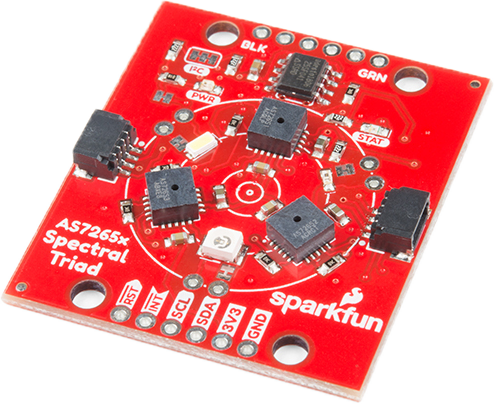
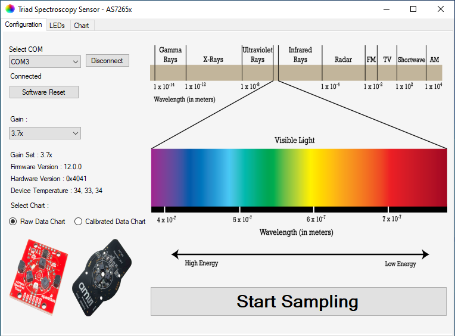
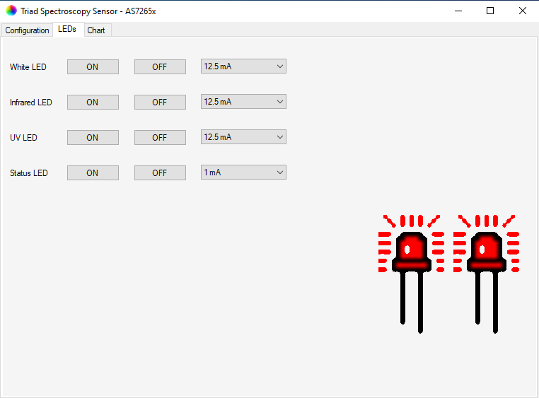
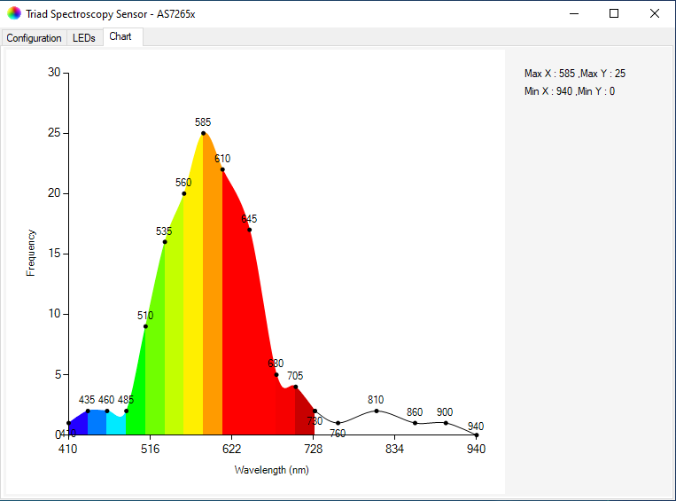

# Triad Spectroscopy Sensor for AS7265x module
Windows GUI control and data representation program for AS7265x module.

## Modules
[ams module](https://ams.com/as7265x)  
[SparkFun module](https://www.sparkfun.com/products/15050)

## Images

## Build
Build in .NET Framework 4.8

1. Open Visual Studio.
2. Go File -> Clone a repository...
3. Copy and paste the HTTPS link from github project to Repository location and select a local path where the project will be saved.
4. Press Clone.
5. Next go to Solution Explorer right click o project and select Manage NuGet Packages...
6. Click on Restore button on the new tab.
7. Right click on project and select Build.
8. Find the executable in project folder.
